# 7일차 - 앱 실행화면 (프론트엔드 템플릿 ↔ API 연결)

`static/`에 제공된 프론트엔드 화면이 FastAPI 백엔드 API를 호출하도록 연결한 내용이다.

서버 실행 후 브라우저에서 `http://127.0.0.1:8000/`으로 접속해 확인한다.

```bash
fastapi run app/main.py
```

## 1. 회원가입 — `POST /api/v1/users/signup`

- 프론트 화면: `/signup`
- 사용자가 이메일, 비밀번호, 이름, 부서, 성별, 휴대폰 번호를 입력하고 **가입하기**를 누른다.
- 프론트엔드는 입력값을 JSON 요청 본문으로 보내고, 성공하면 안내 창을 띄운 뒤 로그인 화면으로 이동한다.
- 부서 값은 `MEDICAL`, `DEV`, `RESEARCH`, 성별 값은 `M`, `F`처럼 서버가 정한 값으로 전송해야 한다.

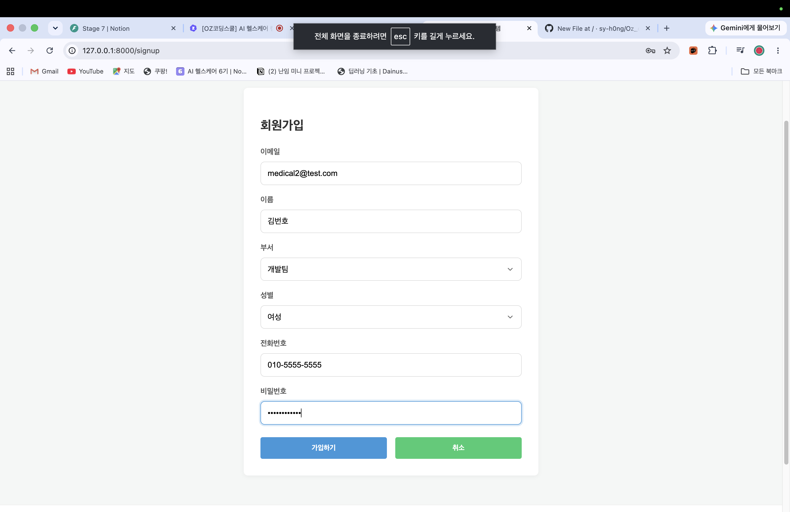

## 2. 로그인 — `POST /api/v1/users/login`

- 프론트 화면: `/login`
- 이메일과 비밀번호를 입력하면 로그인 API를 호출한다.
- 요청은 OAuth2 형식의 `username`, `password` 폼 데이터로 전송된다.
- 성공하면 Access Token을 브라우저 저장소에 보관하고 환자 목록 화면으로 이동한다. Refresh Token은 서버가 HttpOnly 쿠키로 관리한다.

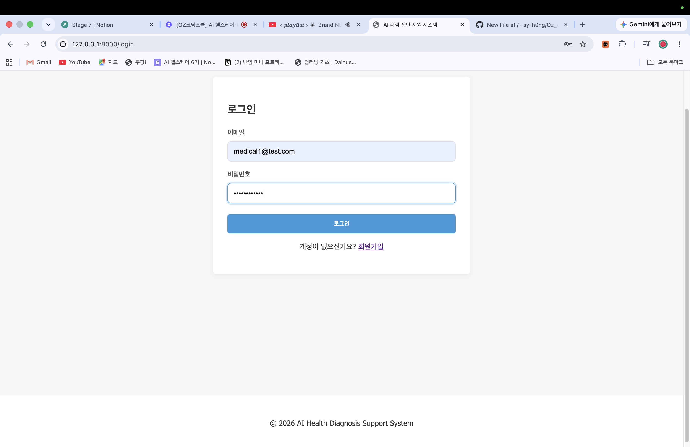

## 3. 로그아웃 — `POST /api/v1/users/logout`

- 상단 메뉴의 **로그아웃** 버튼이 로그아웃 API를 호출한다.
- Refresh Token 쿠키와 프론트엔드의 로그인 상태를 정리한 뒤 로그인 화면으로 이동한다.

## 4. 내 정보 조회·수정 — `GET`, `PATCH /api/v1/users/me`

- 프론트 화면: `/mypage`
- 로그인한 사용자의 이름, 이메일, 부서, 성별, 연락처, 권한을 보여준다.
- 수정 화면에서는 부서와 휴대폰 번호만 바꿔 `PATCH /api/v1/users/me`으로 보낸다.

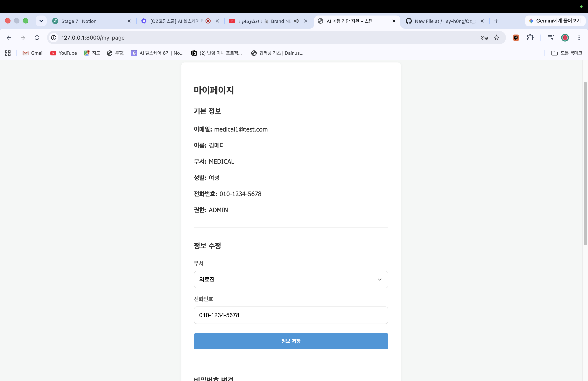

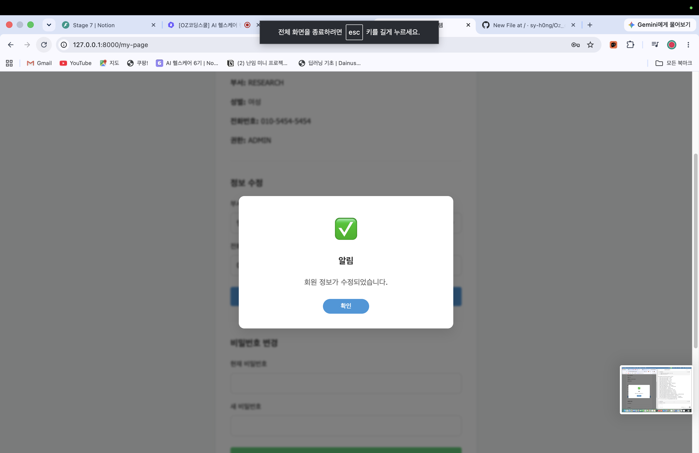

## 5. 비밀번호 변경 — `PATCH /api/v1/users/me/password`

- 프론트 화면: `/mypage`
- 기존 비밀번호와 새 비밀번호를 입력한다.
- 프론트엔드는 두 값을 비밀번호 변경 API로 보내고, 서버는 기존 비밀번호가 맞을 때만 변경한다.

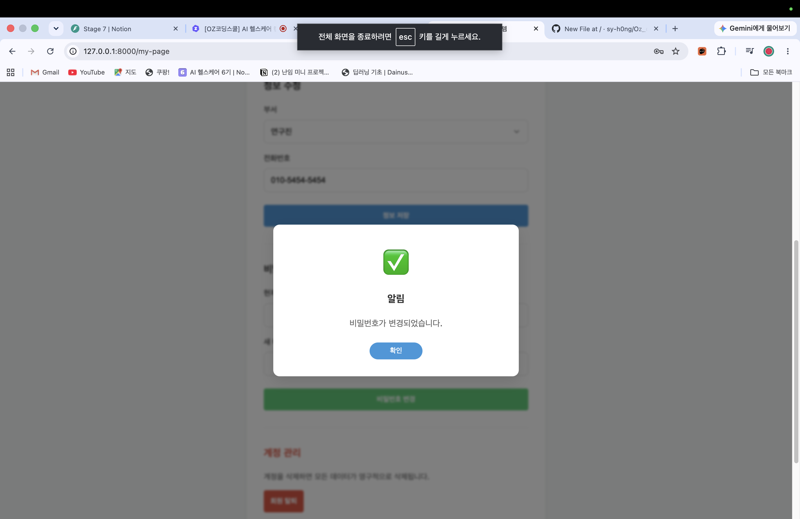

## 6. 회원 탈퇴 — `DELETE /api/v1/users/me`

- 프론트 화면: `/mypage`
- 탈퇴 확인 창에서 확정하면 현재 사용자 삭제 API를 호출한다.
- 성공하면 로그인 정보가 사라지고 로그인 화면으로 이동한다.

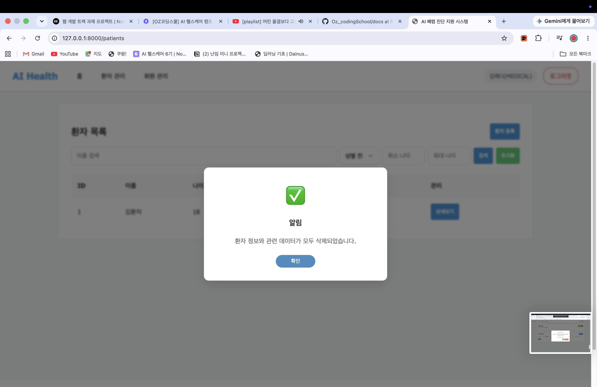

## 7. 관리자 회원 목록·권한 변경

### 회원 목록 — `GET /api/v1/admin/users`

- 프론트 화면: `/admin/users`
- 관리자만 접근할 수 있다.
- 검색어(`query`)와 부서(`department`)를 선택하면 프론트엔드가 쿼리 파라미터로 보내고, 목록을 다시 그린다.

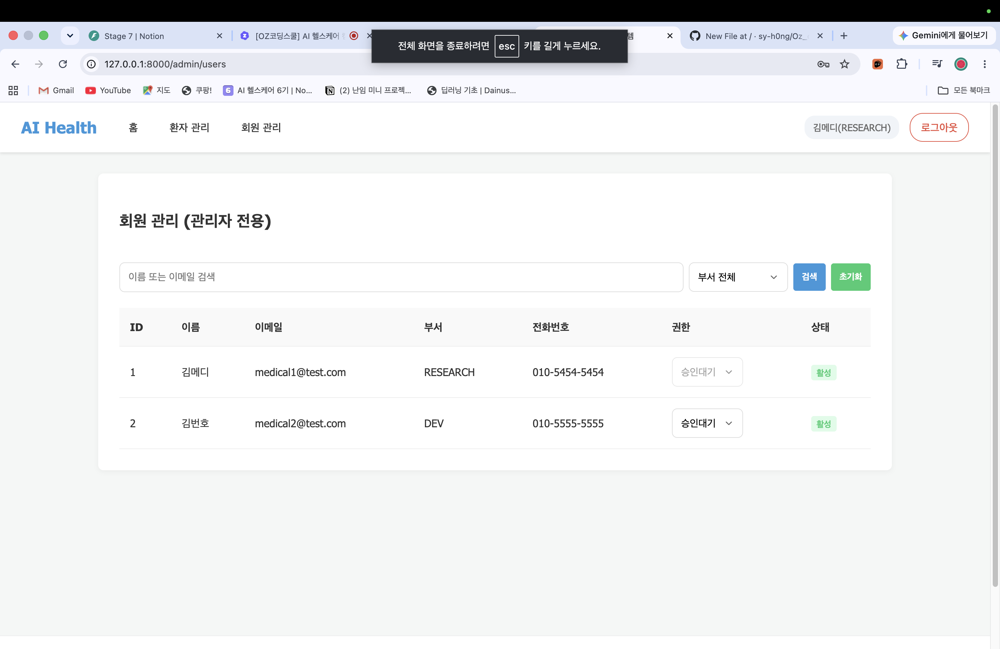

### 권한 변경 — `PATCH /api/v1/admin/users/role`

- 관리자 화면에서 대상 사용자의 권한을 선택해 변경한다.
- 프론트엔드는 대상 사용자 ID와 새 역할을 요청 본문으로 보내고, 성공하면 회원 목록을 새로 불러온다.


## 8. 환자 등록 — `POST /api/v1/patients`

- 프론트 화면: `/patients/create`
- 이름, 나이, 성별, 연락처를 입력하고 등록한다.
- 프론트엔드는 JSON으로 환자 등록 API를 호출하고, 성공하면 환자 목록으로 돌아간다.

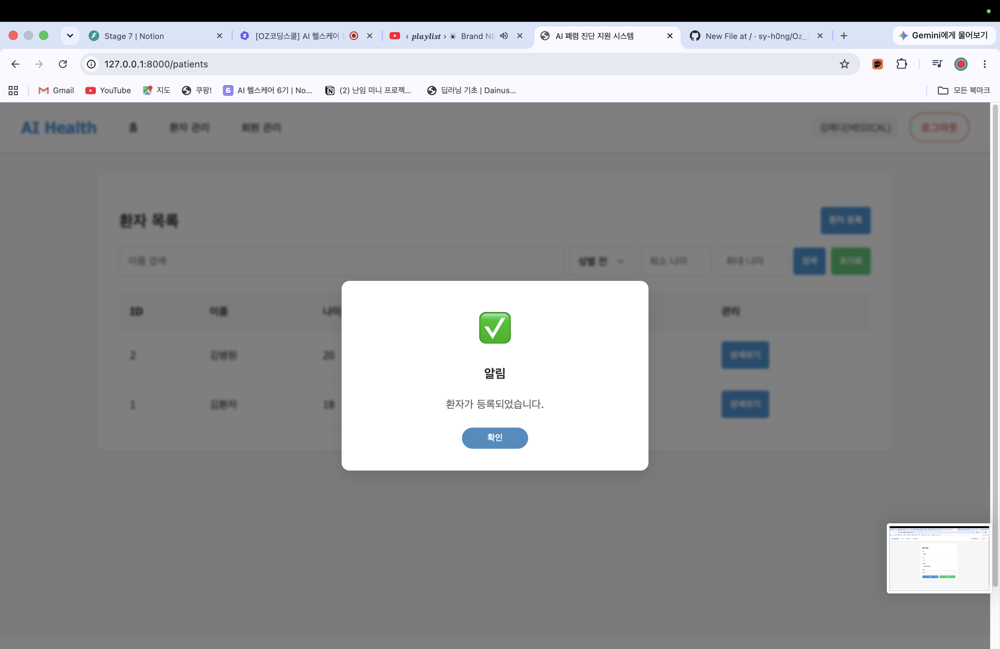

## 9. 환자 목록·검색 — `GET /api/v1/patients`

- 프론트 화면: `/patients`
- 이름 검색과 성별, 최소 나이, 최대 나이 필터를 제공한다.
- 프론트엔드는 `name`, `gender`, `min_age`, `max_age`를 쿼리 파라미터로 보내며, 응답 받은 환자들을 표에 표시한다.

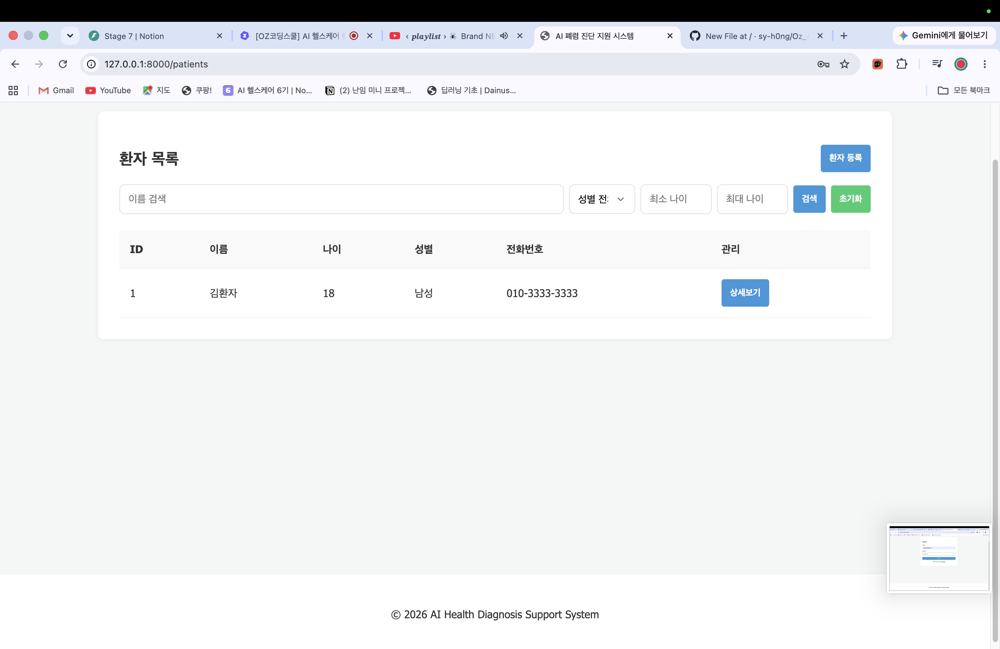

## 10. 환자 상세 조회 — `GET /api/v1/patients/{patient_id}`

- 프론트 화면: `/patients/{patient_id}`
- 환자 한 명의 기본 정보와 해당 환자의 진료기록 목록을 보여준다.
- 환자 상세 정보와 진료기록 목록 API를 각각 호출해 화면을 구성한다.

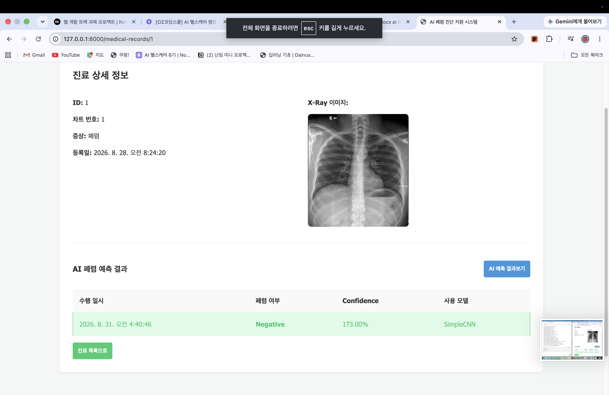

## 11. 환자 수정 — `PATCH /api/v1/patients/{patient_id}`

- 프론트 화면: 환자 상세 화면의 수정 창
- 이름과 연락처만 수정할 수 있다.
- 수정 성공 후 환자 상세 정보를 다시 불러와 화면에 최신 값을 표시한다.

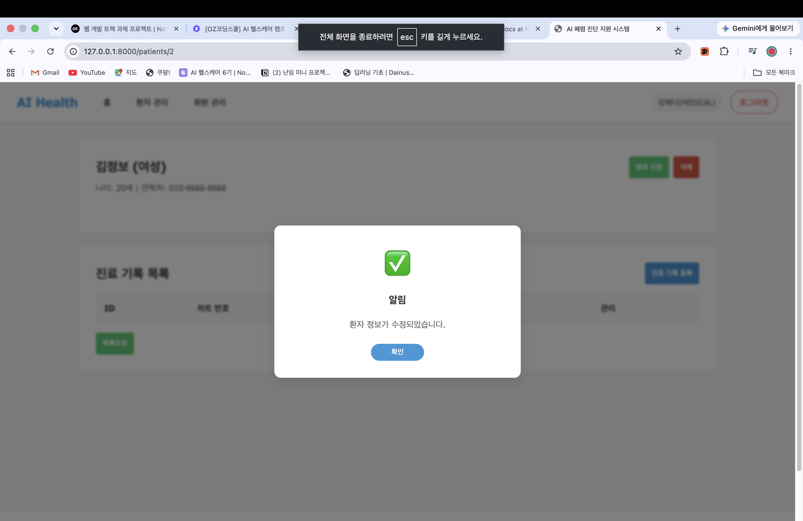

## 12. 환자 삭제 — `DELETE /api/v1/patients/{patient_id}`

- 프론트 화면: 환자 상세 화면의 삭제 확인 창
- 삭제를 확정하면 환자 삭제 API를 호출하고 환자 목록으로 이동한다.
- 백엔드에서는 요구사항에 따라 해당 환자와 연결된 진료기록 및 X-Ray 데이터도 함께 처리한다.

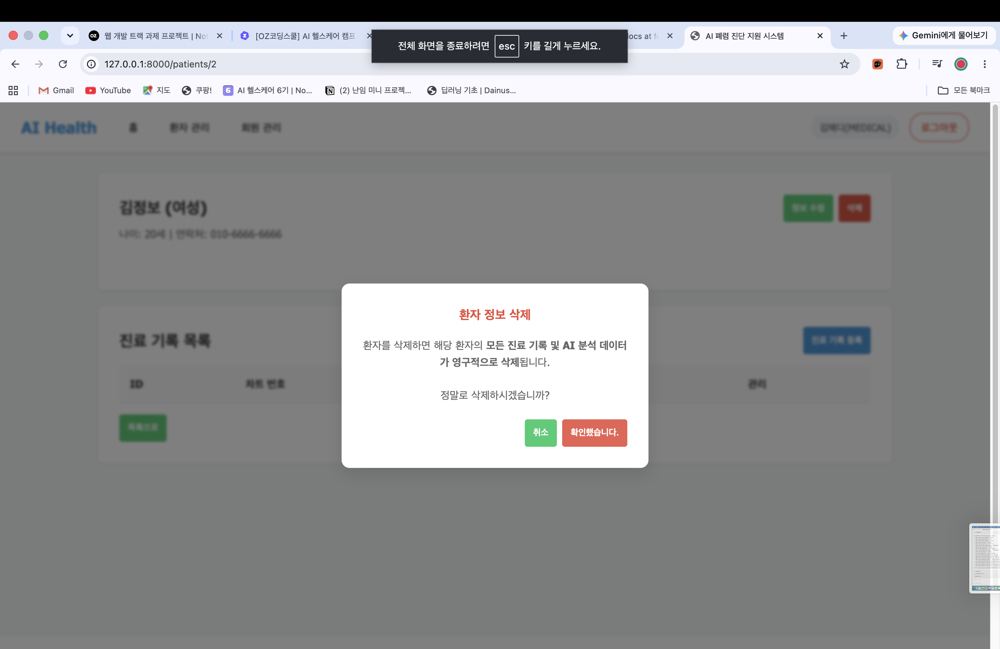

## 13. 진료기록 등록 — `POST /api/v1/medical-records`

- 프론트 화면: `/patients/{patient_id}/medical-records/create`
- 차트 번호, 증상, X-Ray 이미지를 입력·선택해 등록한다.
- 텍스트와 이미지 파일을 함께 보내야 하므로 프론트엔드는 `FormData`로 요청한다.
- 서버는 이미지를 `media/xray/`에 저장하고, 차트 번호가 중복되면 `409 Conflict`를 응답한다.

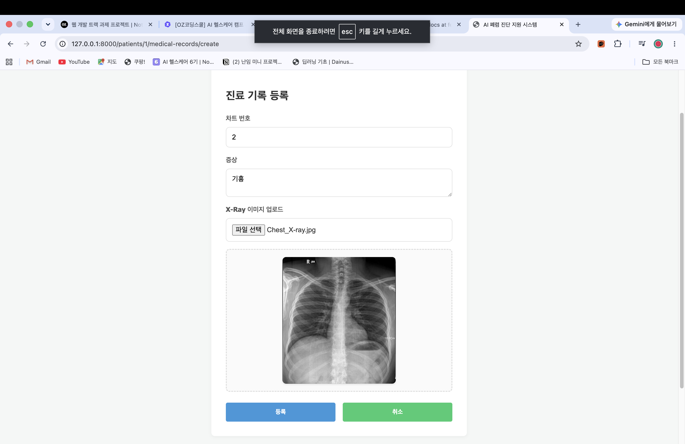

## 14. 진료기록 목록·상세

### 환자별 진료기록 목록 — `GET /api/v1/patients/{patient_id}/medical-records`

- 환자 상세 페이지에서 해당 환자의 진료기록을 목록으로 보여준다.
- 증상은 목록에서 길면 축약해 보여주고, 상세보기 버튼으로 진료기록 상세 화면으로 이동한다.

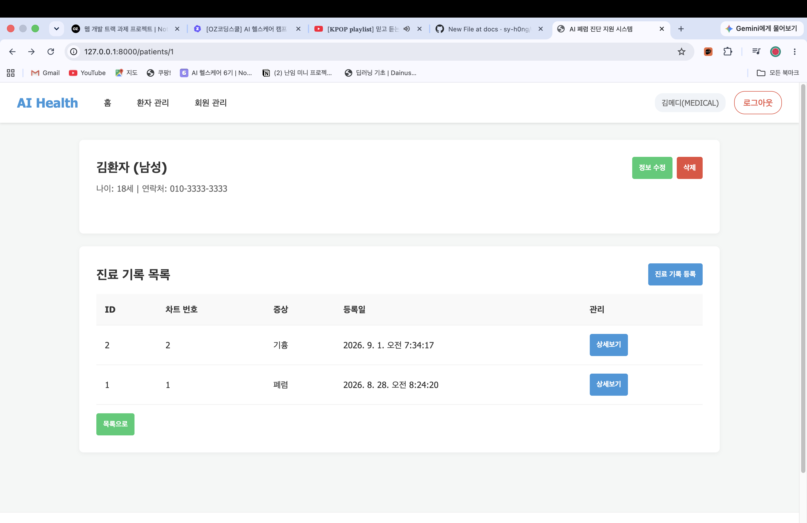

### 진료기록 상세 — `GET /api/v1/medical-records/{medical_record_id}`

- 진료기록의 차트 번호, 전체 증상, 생성일시, 업로드된 X-Ray 이미지를 표시한다.
- 응답의 `xray_images` 배열에서 첫 번째 이미지의 `image_url`을 사용해 화면에 X-Ray를 표시하도록 연결했다.

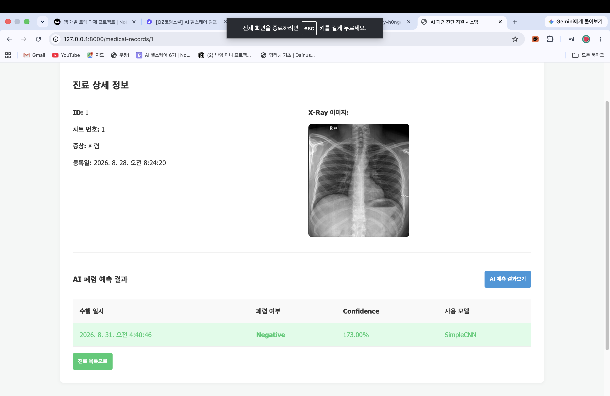

## 15. AI 폐렴 예측·결과 조회

### 예측 실행 — `POST /api/v1/medical-records/{medical_record_id}/predict`

- 진료기록 상세 화면의 AI 예측 버튼이 이 API를 호출한다.
- 저장된 X-Ray 이미지로 모델 추론을 수행하고, 동일 진료기록과 동일 모델의 결과가 이미 있다면 저장된 결과를 재사용한다.

### 예측 결과 조회 — `GET /api/v1/medical-records/{medical_record_id}/analyses`

- 진료기록 상세 화면에서 예측 결과 목록을 불러온다.
- 결과에는 폐렴 여부, Confidence, 히트맵 URL(있는 경우), 예측 수행일시, 사용 모델을 표시한다.
- Confidence는 소수(예: `0.93`)로 받은 값을 화면에서 퍼센트(예: `93.00%`)로 바꿔 보여준다.


## 실행 시 확인할 점

1. `.env`의 MySQL 연결 정보가 현재 로컬 DB와 맞아야 한다.
2. 먼저 DB 스키마를 적용한다.

```bash
uv run alembic upgrade head
```

3. FastAPI 서버를 실행한 뒤 회원가입 → 로그인 → 환자 등록 → 진료기록 등록 → AI 예측 순서로 확인한다.
4. API는 브라우저 화면뿐 아니라 `http://127.0.0.1:8000/docs`의 Swagger UI에서도 개별 테스트할 수 있다.
