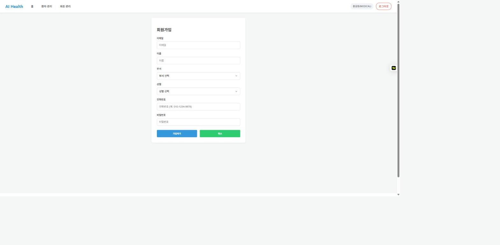
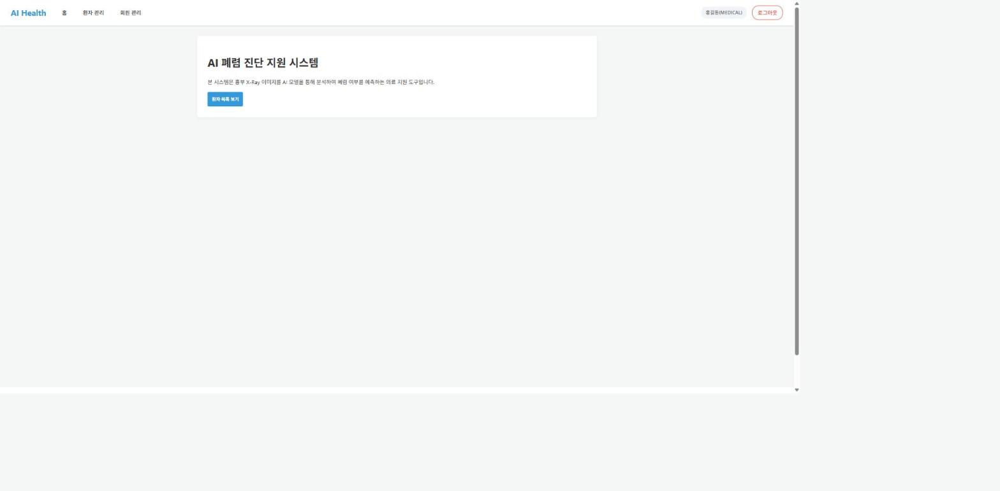
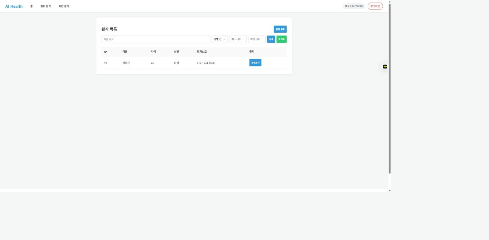
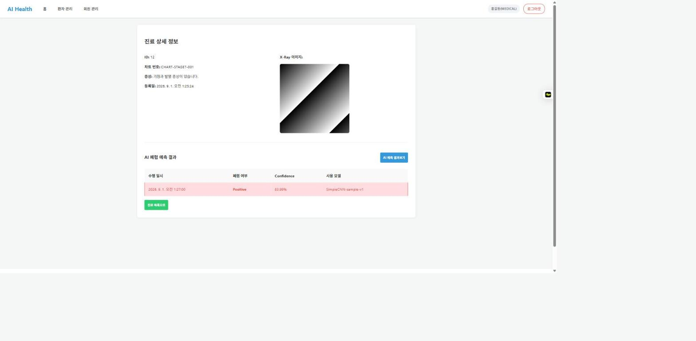
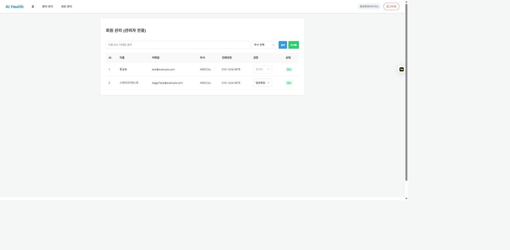

# 7일차 - 앱 실행 화면 (프론트 템플릿 ↔ API 연결 확인)

`fastapi run app/main.py` 로 서버를 띄운 뒤 `http://127.0.0.1:8000/` 에서 `static/` 프론트엔드
템플릿이 실제 백엔드 API(users / patients / medical-records / predictions)와 정상적으로
연동되는지 확인했다. 아래는 각 endpoint별 실행 화면과, 연결 과정에서 발견/수정한 이슈다.

## 1. 회원가입 — `POST /api/v1/users/signup`

이메일/이름/부서/성별/전화번호/비밀번호를 입력해 가입하면, 로그인 전까지는 `PENDING` 권한으로
생성되고 관리자 승인 후 서비스를 이용할 수 있다.

## 2. 홈 / 로그인 — `POST /api/v1/users/login`

로그인 성공 시 Access Token을 저장하고, 사용자 권한에 따라(`STAFF`/`ADMIN`이면 환자 목록,
`PENDING`이면 승인 대기 안내) 홈 화면을 다르게 렌더링한다.

## 3. 환자 목록 / 등록 / 상세·수정 — `GET,POST /api/v1/patients`, `GET,PATCH,DELETE /api/v1/patients/{id}`

환자 등록 → 목록 조회 → 상세 조회 → 정보 수정까지 전 과정을 확인했다. 이름 검색, 성별/나이
범위 필터도 정상 동작한다.

## 4. 진료기록 등록/상세 + AI 폐렴 예측 — `POST /api/v1/medical-records`, `GET /api/v1/medical-records/{id}`, `POST,GET /api/v1/medical-records/{id}/predict,/analyses`

환자 상세 페이지에서 진료기록(차트번호/증상/X-Ray 이미지)을 등록하면 상세 페이지에서 업로드한
X-Ray 이미지가 그대로 표시된다. "AI 예측 결과보기"를 누르면 `worker/model.py`의 샘플 모델로
추론을 수행하고, 그 결과(폐렴 여부/Confidence/사용 모델/수행 일시)가 표에 저장·표시된다.
같은 진료기록에 대해 같은 모델로 다시 누르면 재추론 없이 캐시된 결과를 반환한다(REQ-PRED-001).

## 5. 회원 관리(관리자) — `GET /api/v1/admin/users`, `PATCH /api/v1/admin/users/role`

관리자 계정으로 접속하면 전체 회원 목록과 현재 권한을 확인할 수 있고, 드롭다운으로 즉시 권한을
변경(승인대기 → 일반회원/관리자)할 수 있다. 부서로 필터링도 가능하다.

## 6. 연결 과정에서 발견하고 수정한 이슈

프론트 템플릿과 백엔드 API의 계약이 어긋나는 지점이 여러 군데 있어서, 아래와 같이 프론트/백엔드
양쪽을 실제로 값을 넣어 클릭해보며 하나씩 고쳤다.

| # | 증상 | 원인 | 조치 |
| --- | --- | --- | --- |
| 1 | 회원가입 시 항상 422 "가입 실패" | `signup.html`의 부서(`developer`/`medical team`/`researcher`)·성별(`male`/`female`) select 값이 백엔드 `DepartmentEnum`(`DEV`/`MEDICAL`/`RESEARCH`)·`GenderEnum`(`M`/`F`)과 다름 | `signup.html`, `my-page.html`, `admin-users.html`의 select `value`를 백엔드 enum 값으로 수정 (환자 gender는 `male`/`female` 그대로 유지 — 백엔드가 이미 변환 처리함) |
| 2 | 로그인해도 "승인 대기 중" 오탐지, 관리자 메뉴 안 보임 | `app.js`/`pages.js`가 `role`을 `'pending'`/`'admin'` 등 소문자로 비교했지만 실제 응답은 `PENDING`/`ADMIN` 대문자 | `app.js`(4곳), `pages.js`(회원 관리 권한 select 포함) role 비교/옵션 값을 대문자로 수정 |
| 3 | AI 예측 실행 시 500 에러 (`Column 'heatmap_url' cannot be null`) | `6a11c4e8b30f_make_heatmap_url_optional` 마이그레이션 파일은 저장소에 있었지만 로컬 DB에 `alembic upgrade head`가 실행되지 않아 컬럼이 여전히 `NOT NULL` | `alembic upgrade head` 실행 (코드 변경 아님 — **다른 팀원도 pull 후 반드시 `alembic upgrade head` 필요**) |
| 4 | 회원 관리 화면의 권한 드롭다운이 실제 권한과 무관하게 항상 "승인대기"로 보임 | `AdminUserListItem` 응답 스키마에 `role` 필드가 아예 없어 프론트가 값을 못 받음 | `app/schemas/user.py`의 `AdminUserListItem`에 `role: RoleEnum` 필드 추가 |

## 7. 남은 참고 사항

- 위 표의 1·2번은 프론트(`static/`) 수정, 4번은 백엔드(`app/schemas/user.py`) 수정이다.
- 3번은 팀 전체가 로컬 DB에서 `uv run alembic upgrade head`를 한 번 실행해야 한다.
