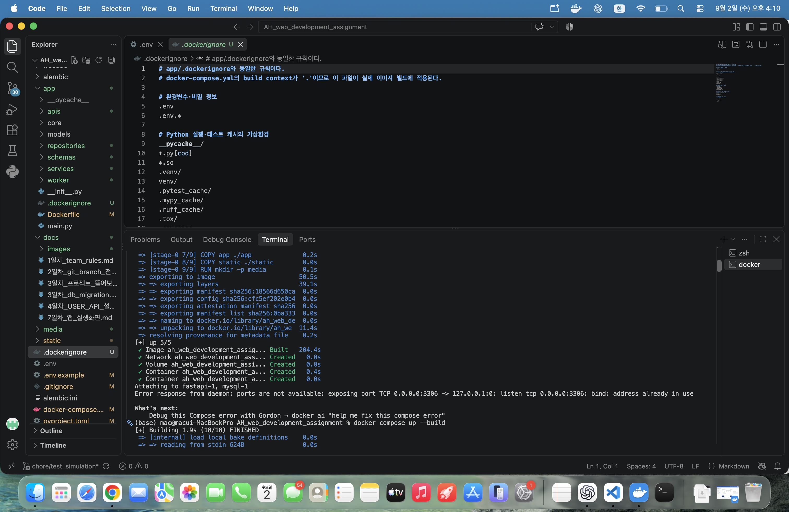
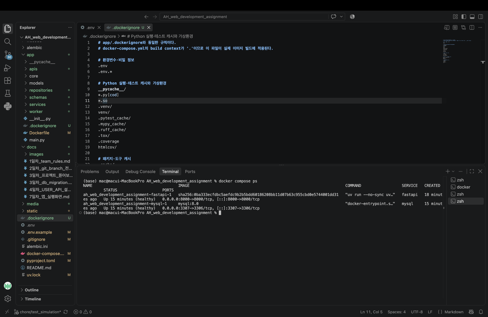

# 8일차 - Docker 이미지 빌드 및 컨테이너 실행 확인

FastAPI 앱과 MySQL을 각각 Docker 컨테이너로 실행했다.

## 실행 명령어

프로젝트 최상단 디렉터리에서 아래 명령어를 실행했다.

```bash
docker compose up --build
```

- `app/Dockerfile`을 이용해 FastAPI 이미지를 빌드한다.
- `docker-compose.yml`이 `fastapi`, `mysql` 서비스를 함께 실행한다.
- FastAPI는 로컬 프로젝트를 컨테이너의 `/app`에 마운트하고 `--reload`로 실행한다.

## 1. Docker 이미지 빌드 확인

아래 화면에서 `Image ... Built`가 표시되어 FastAPI 이미지가 정상적으로 생성된 것을 확인했다.



최초 실행에서는 맥의 로컬 MySQL이 이미 `3306` 포트를 사용하고 있어 Docker MySQL 실행 단계에서 포트 충돌이 발생했다. `docker-compose.yml`에서 Docker MySQL의 호스트 포트를 `3307`로 변경하여 해결했다.

```yml
ports:
  - "3307:3306"
```

컨테이너 내부에서 FastAPI는 서비스 이름을 사용해 `mysql:3306`으로 접속하므로, FastAPI와 MySQL 사이의 연결 포트는 그대로 `3306`이다.

## 2. Docker 컨테이너 실행 확인

아래 명령어로 실행 상태를 확인했다.

```bash
docker compose ps
```

`fastapi`와 `mysql` 컨테이너가 모두 `Up ... (healthy)` 상태인 것을 확인했다.

- FastAPI: 호스트 `8000` 포트 → 컨테이너 `8000` 포트
- MySQL: 호스트 `3307` 포트 → 컨테이너 `3306` 포트



## 접속 주소

컨테이너 실행 후 다음 주소로 FastAPI 앱과 API 문서를 확인할 수 있다.

```text
앱 화면: http://127.0.0.1:8000
Swagger UI: http://127.0.0.1:8000/docs
```
