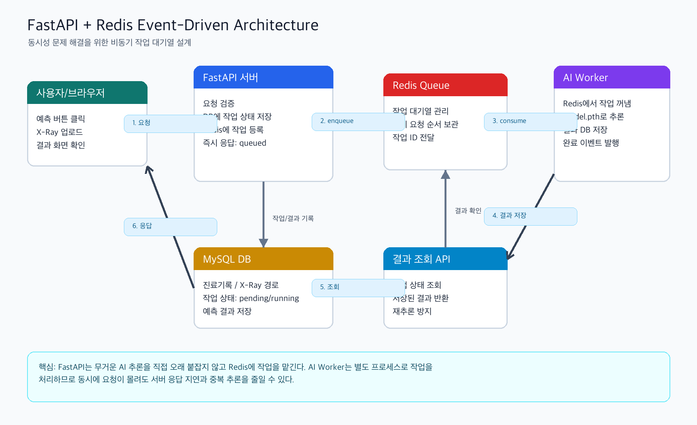

# 9일차 동시성 문제 해결을 위한 아키텍처 설계

## 1. FastAPI와 Redis 기반 Event-Driven Architecture

Event-Driven Architecture는 요청이 들어왔을 때 모든 일을 한 번에 처리하지 않고, “일이 발생했다”는 이벤트를 기준으로 작업을 나누어 처리하는 구조이다.

예를 들어 사용자가 흉부 X-Ray 이미지를 업로드하고 AI 폐렴 예측을 요청하면, FastAPI 서버가 직접 오래 기다리면서 모델 추론까지 모두 처리할 수도 있다. 하지만 AI 추론은 시간이 오래 걸릴 수 있고, 동시에 여러 사용자가 요청하면 서버가 느려질 수 있다.

이 문제를 줄이기 위해 FastAPI와 AI Worker의 역할을 분리한다.

| 구성 요소 | 역할 |
| --- | --- |
| FastAPI 서버 | 사용자 요청을 받고, 요청 검증과 작업 등록을 담당한다. |
| Redis Queue | 처리해야 할 작업을 순서대로 보관하는 대기열 역할을 한다. |
| AI Worker | Redis에서 작업을 하나씩 꺼내 AI 모델 추론을 수행한다. |
| MySQL DB | 진료기록, X-Ray 이미지 경로, 작업 상태, 예측 결과를 저장한다. |

## 2. 왜 Redis를 사용하는가?

Redis는 메모리 기반 저장소라 빠르게 데이터를 읽고 쓸 수 있다. 이 프로젝트에서는 Redis를 작업 대기열로 사용한다.

Redis Queue를 사용하면 다음 장점이 있다.

| 장점 | 설명 |
| --- | --- |
| 동시 요청 처리 | 여러 예측 요청이 동시에 들어와도 작업을 Redis에 쌓아두고 순서대로 처리할 수 있다. |
| 서버 응답 속도 개선 | FastAPI는 작업을 등록한 뒤 바로 응답하고, 무거운 AI 추론은 Worker가 처리한다. |
| 역할 분리 | FastAPI는 API 요청 처리, AI Worker는 모델 추론에 집중한다. |
| 장애 대응 | 작업 상태를 DB에 저장하면 실패한 작업을 추적하거나 재시도하기 쉽다. |
| 확장성 | 요청이 많아지면 AI Worker 수를 늘려 처리량을 높일 수 있다. |

## 3. 동시성 문제

AI 예측 기능에서 발생할 수 있는 동시성 문제는 다음과 같다.

| 문제 | 예시 | 해결 방향 |
| --- | --- | --- |
| 서버 응답 지연 | 여러 사용자가 동시에 예측을 요청하여 FastAPI 서버가 오래 대기함 | FastAPI는 작업 등록만 하고 즉시 응답 |
| 중복 추론 | 같은 진료기록에 대해 여러 요청이 동시에 들어와 같은 모델 추론이 반복됨 | `record_id`와 `ai_model` 기준으로 기존 결과 확인 |
| 작업 순서 혼란 | 요청이 몰렸을 때 어떤 작업이 먼저 처리되어야 하는지 불명확함 | Redis Queue에 작업을 순서대로 저장 |
| 장애 추적 어려움 | AI 추론 중 오류가 났을 때 사용자가 상태를 알 수 없음 | DB에 작업 상태를 `pending`, `running`, `done`, `failed`로 저장 |

## 4. 설계 방향

### 4.1 FastAPI의 역할

FastAPI는 사용자의 요청을 받는 입구 역할을 한다.

FastAPI가 담당하는 일은 다음과 같다.

1. 로그인 유저의 인증과 권한을 확인한다.
2. 예측 대상 진료기록과 X-Ray 이미지가 존재하는지 확인한다.
3. 같은 모델의 예측 결과가 이미 있는지 확인한다.
4. 새 예측이 필요하면 DB에 작업 상태를 `pending`으로 저장한다.
5. Redis Queue에 작업 ID와 필요한 정보를 넣는다.
6. 사용자에게 “작업이 등록되었다”는 응답을 빠르게 반환한다.

FastAPI는 AI 모델을 직접 오래 실행하지 않는다. 이렇게 해야 API 서버가 동시에 들어오는 요청을 안정적으로 처리할 수 있다.

### 4.2 Redis Queue의 역할

Redis는 FastAPI와 AI Worker 사이에서 작업을 전달하는 중간 창구 역할을 한다.

예측 요청이 들어오면 FastAPI는 Redis에 다음과 같은 작업 메시지를 넣는다.

```json
{
  "job_id": 1,
  "record_id": 10,
  "xray_image_url": "/media/xrays/sample.png",
  "ai_model": "SimpleCNN-sample-v1"
}
```

Redis Queue는 이 작업을 순서대로 보관하고, AI Worker가 준비되면 하나씩 꺼내 처리하게 한다.

### 4.3 AI Worker의 역할

AI Worker는 FastAPI와 별도로 실행되는 프로세스이다.

AI Worker가 담당하는 일은 다음과 같다.

1. Redis Queue에서 예측 작업을 꺼낸다.
2. 작업 상태를 `running`으로 바꾼다.
3. X-Ray 이미지 파일을 읽는다.
4. 메모리에 올라와 있는 AI 모델로 폐렴 여부를 예측한다.
5. 예측 결과를 DB에 저장한다.
6. 작업 상태를 `done`으로 바꾼다.
7. 실패하면 작업 상태를 `failed`로 바꾸고 오류 원인을 기록한다.

## 5. 아키텍처 도식화

아래 이미지는 FastAPI와 AI Worker의 작업을 분리하고, Redis를 작업 대기열로 사용하는 구조를 나타낸 것이다.



## 6. 전체 처리 흐름

| 순서 | 처리 내용 |
| --- | --- |
| 1 | 사용자가 진료기록 상세 페이지에서 AI 예측 버튼을 클릭한다. |
| 2 | FastAPI가 요청을 받고 인증, 권한, 진료기록, X-Ray 이미지 존재 여부를 확인한다. |
| 3 | FastAPI가 DB에 예측 작업 상태를 `pending`으로 저장한다. |
| 4 | FastAPI가 Redis Queue에 예측 작업 메시지를 넣는다. |
| 5 | FastAPI는 사용자에게 작업 ID와 `queued` 상태를 응답한다. |
| 6 | AI Worker가 Redis Queue에서 작업을 꺼낸다. |
| 7 | AI Worker가 작업 상태를 `running`으로 바꾸고 AI 모델 추론을 실행한다. |
| 8 | AI Worker가 예측 결과를 DB에 저장하고 작업 상태를 `done`으로 바꾼다. |
| 9 | 사용자는 결과 조회 API를 통해 저장된 예측 결과를 확인한다. |

## 7. API 설계 예시

| 기능 | Method | Endpoint | 설명 |
| --- | --- | --- | --- |
| AI 예측 작업 등록 | POST | `/api/v1/medical-records/{record_id}/predict-jobs` | 진료기록의 X-Ray 이미지를 바탕으로 예측 작업을 Redis Queue에 등록한다. |
| AI 예측 작업 상태 조회 | GET | `/api/v1/prediction-jobs/{job_id}` | 예측 작업의 현재 상태를 조회한다. |
| AI 예측 결과 조회 | GET | `/api/v1/medical-records/{record_id}/analyses` | 완료된 AI 예측 결과 목록을 조회한다. |

## 8. 기대 효과

이 구조를 사용하면 FastAPI 서버와 AI Worker가 분리되어 각자의 역할에 집중할 수 있다.

FastAPI는 사용자의 요청을 빠르게 받고 응답하며, AI Worker는 무거운 모델 추론을 별도로 처리한다. Redis는 두 시스템 사이에서 작업을 안전하게 전달하는 대기열 역할을 한다.

결과적으로 동시에 많은 예측 요청이 들어와도 API 서버가 멈추거나 느려지는 문제를 줄일 수 있고, 같은 진료기록에 대한 중복 추론도 방지할 수 있다.
